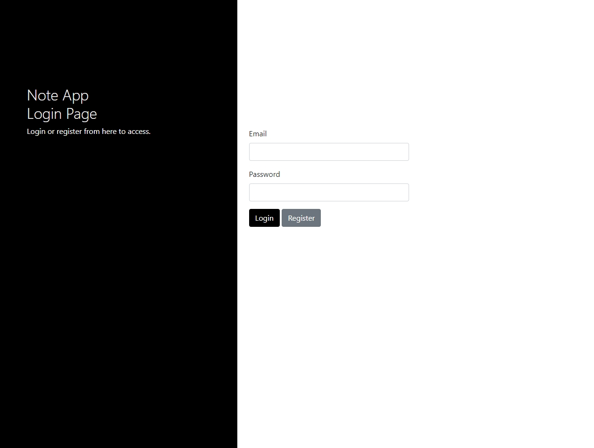
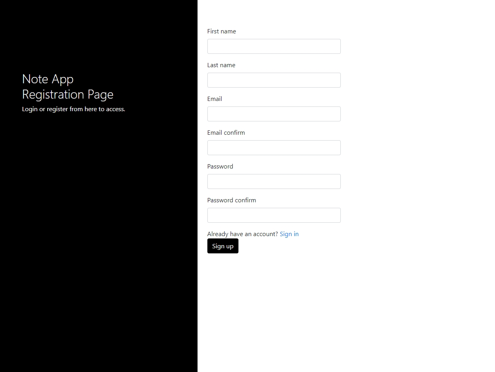
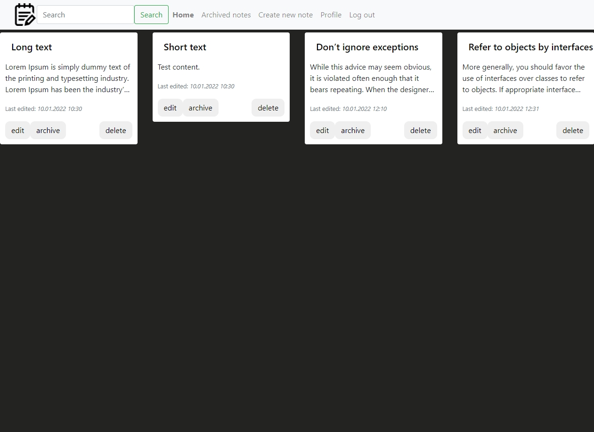
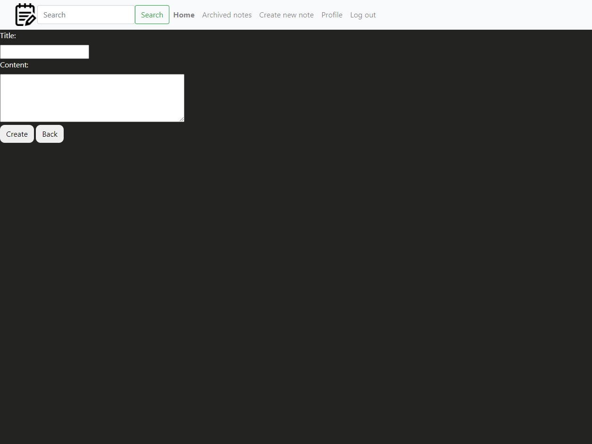
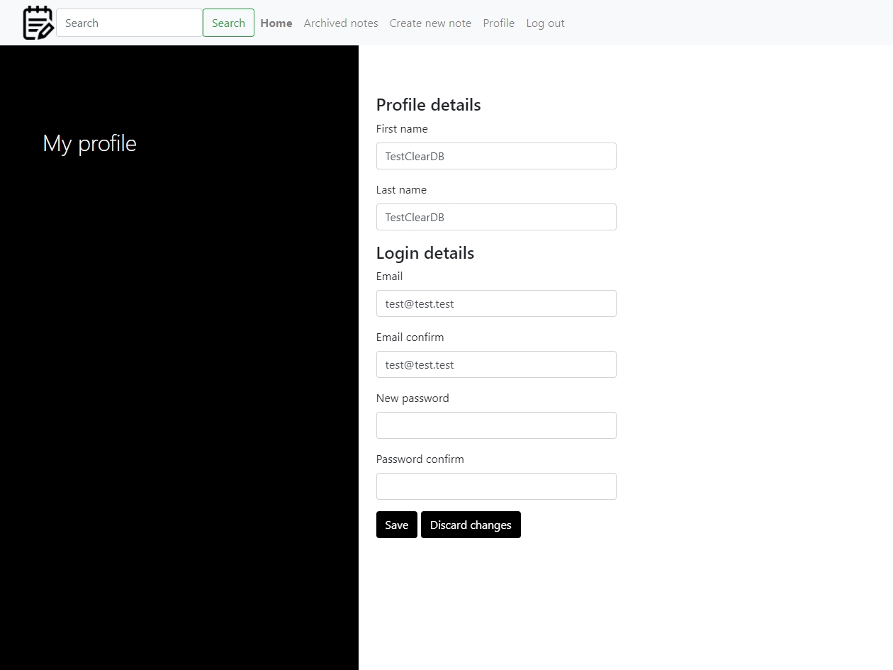

# NoteApp
This is a web app for manage personal notes on the web.

You may check that application by opening the link:
https://noteapp-project.herokuapp.com/

This app can do:
- Allows the user to create personal account, login to it and save his personal notes.
- CRUD Operations: create/read/update/delete notes.
- Search through notes.
- Update personal credentials in "Profile" tab.

## Technology used
- Java
- Spring: Core, MVC, Security.
- JDBC, MySQL.
- Thymeleaf, Bootstrap, Masonry layout library.
- Tomcat 9 web server
- Gradle

## Default User for testing purposes
- email: test@test.test
- password: test

## Screenshots
- Login page

- Registration page

- All notes

- New note

- User profile
